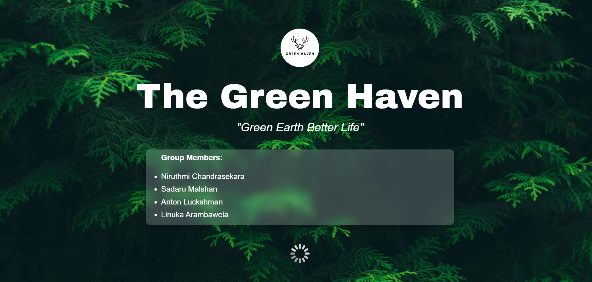

# The Green Haven 

<i>Green Earth Better Life</i>

<table align="center">
    <thead align="center">
        <tr border: 1px;>
            <td><b>🌟 Stars</b></td>
            <td><b>🔔 Open PRs</b></td>
            <td><b>🔕 Close PRs</b></td>
        </tr>
     </thead>
    <tbody>
         <tr>
            <td></td>
            <td></td>
           <td></td>
        </tr>
    </tbody>
</table>

The Green Haven is the group project for Web Design and Development module of University of Westminster

### 💻 **Tech Stacks**

  

  <h2 align = "center">Project Contributors</h2>
  

  <h2>🔗 Contact Us</h2>

<table>
    <tr>
        <th>Name</th>
        <th>Role</th>
        <th>LinkedIn</th>
        <th>Email</th>
    </tr>
    <tr>
        <td>Linuka Arambawela</td>
        <td>Student 1</td>
        <td><a href="https://www.linkedin.com/in/linuka-arambawela/" target="_blank">LinkedIn</a></td>
        <td>linuka.20232610@iit.ac.lk</td>
    </tr>
    <tr>
        <td>Sandaru Thathsara</td>
        <td>Student 2</td>
        <td><a href="https://www.linkedin.com/in/sandaru-thathsara-b20a3b2b2/" target="_blank">LinkedIn</a></td>
        <td>sandaru.20230184@iit.ac.lk</td>
    </tr>
    <tr>
        <td>Anton Luckshman</td>
        <td>Student 3</td>
        <td><a href="https://www.linkedin.com/in/anton-luckshman-53121a265/" target="_blank">LinkedIn</a></td>
        <td>luckshman.20232578@iit.ac.lk</td>
    </tr>
    <tr>
        <td>Niruthmi Chandrasekara</td>
        <td>Student 4</td>
        <td><a href="#" target="_blank">LinkedIn</a></td>
        <td>niruthmi.20232558@iit.ac.lk</td>
    </tr>
    
</table>

⭐️ Support Our Project
If you find this project helpful, please consider giving it a star on GitHub! Your support helps to grow the project.

### Show some ❤️ by starring this awesome repository!

